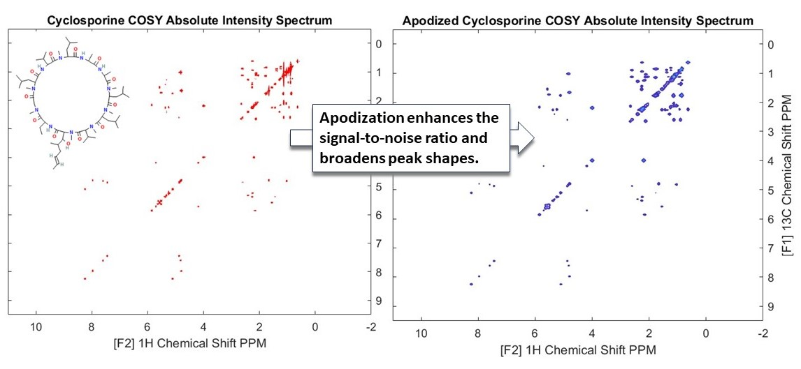

## 5. Processing 2D NMR COSY   

In this example, we have explored the processing of 2D NMR COSY (Correlation Spectroscopy) spectra using Cyclosporine as an example. This NMR data is kindly provided by Prof. Ilya Kuprov, University of Southampton.
COSY experiments are instrumental in revealing couplings between homonuclear nuclei (like hydrogen atoms) in a molecule. These couplings are manifested as cross peaks in the spectra, providing critical insights into the molecular structure. We have demonstrated how the absolute values of the spectra can be used to show the peaks. In addition to being enhanced with appropriate apodization functions. In this case we have used an exponential decay function to make the weaker peaks more prominent (see the above figure).  

### Usage

This code can be opened in [MATLAB® Online™](https://matlab.mathworks.com/).

